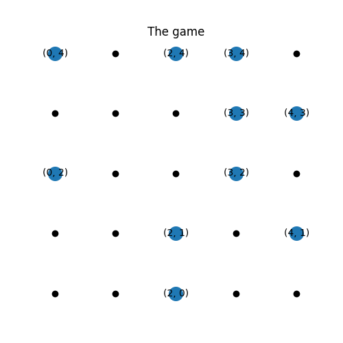
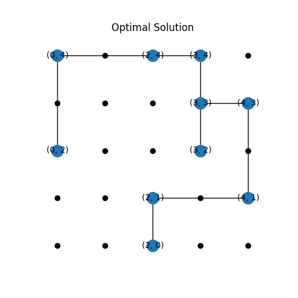

# Yashi Game solver

An instance of the Yashi game is specified by a n×n integer grid for some n > 2, on which p > 2 nodes are placed. A solution of the game consists in drawing horizontal and vertical segments, satisfying the following conditions:
1.  Every segment connects two and only two nodes.
2.  No two segments overlap.
3.  No two segments cross each other.
4.  You can connect any two nodes by using a single horizontal or single vertical line. 
5. The segments form a tree, i.e., they form a graph without cycles. Put differently still, for everytwo nodes a and b there is exactly one path between a and b.
6. An optimal solution is that which satisfies constraints 1-5 and has the minimum total segment length of the possible solutions.

This program encodes the Yashi Game in propositional logic to obtain an optimal solution, it takes an input file of the points for the game or generates them randomly.

## Examples
Some examples of valid commands using points given as a file:

    $ python main.py --grid-size 5 --sat-mode maxsat --points-mode file --file-path data\solvable.csv 
    $ python main.py --grid-size 5 --sat-mode maxsat --points-mode file --file-path data\crossings.csv
    $ python main.py --grid-size 5 --sat-mode maxsat --points-mode file --file-path data\unconnected.csv

Points being randomly generated:

    $ python main.py --grid-size 5 --sat-mode maxsat --points-mode random --num-points 12
    $ python main.py --grid-size 5 --sat-mode sat --points-mode random --num-points 12

## Requirements
    $ pip install -r requirements.txt

Recommended: Python 3.10

## References
1. http://www.sumsumpuzzle.com/yashi2.htm
2. https://www.cs.bu.edu/faculty/kfoury/UNI-Teaching/CS512/AK_Documents/Modeling-with-PL/main.pdf
